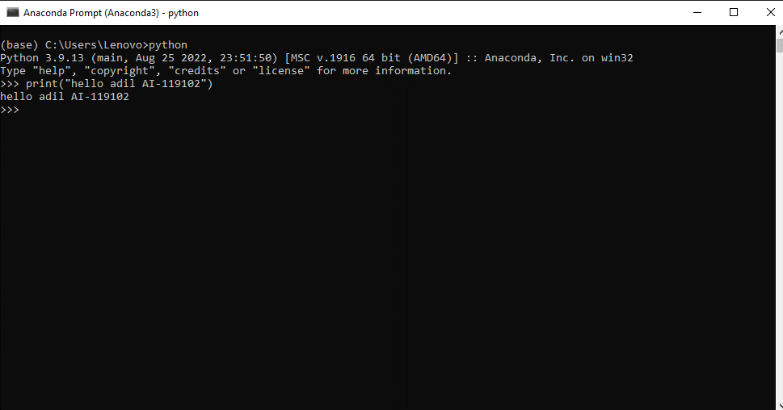

# Python hello adil AI-119102
  ## STEP1: console
   * search
     * anaconda
       * conda prompt
          * python
                ```print("hello adil AI-119102")```
                
                
                
                      


 ## Step2: Create physical file filename.py
   * create the folder or directory
     * go to the path and clear and write in cmd and type code.
       * its open the Vs code
         
         * Explore and create new file task.py
         
          ```print("hello adil AI-119102")```

         


## Step3: Create Jupyter notebook
   * conda prompt
    * jupyter notebook
     * right top >new create new

     


## Step4: create file with jupyter lab
   *conda prompt -> cd path 

      


## step 4: open in IDE
  * open VS code
     * create .py file
      * and run it 

        

## step 6: Google collab 
   * you must have a google account 
     * and go to google and type google collab
       * create the google file

              